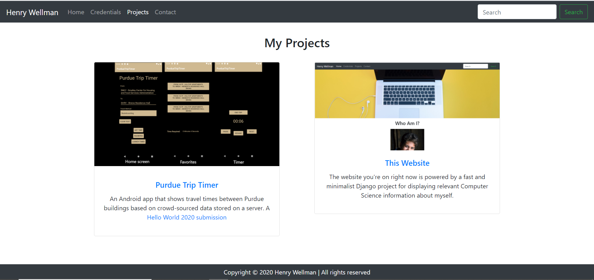

# Personal-Portfolio-Site
A fast and minimalist Django project for displaying relevant Computer Science information about myself.
Considering this was my first ever attempt at making a proper site, and that this was my first time working
with the Django framework, I am very proud of what I have accomplished. Obviously, it's not perfect, and I will 
continually update the project accordingly, as I get better and more familiar with Django and HTML/CSS!

## Demo-Video
Click On Image To Watch Demo Video!

Or Just Click Here
https://www.youtube.com/watch?v=Tpazv-hO5-w

## Screenshots

[More screenshots](screenshots/)

## What's Next For This Site?
- Adding small improvements to interface and photos every now and then.
- Will continue to update things like resume to the most recent version.
- Currently looking into how to put the project into production, most likely on an AWS LightSail  instance.

